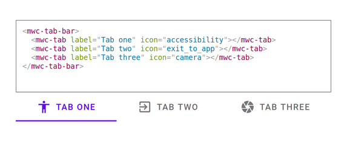

# `<live-element>`

A custom element to live edit other custom elements. Like react-live, but for web components (custom elements).

💫️ [Demos](https://live-element.glitch.me/)



## Usage

Install by

```
yarn add @hunchcloud/live-element
```

Insert the following HTML

```html
<live-element>
  <template>
    <your-custom-element></your-custom-element>
  </template>
<live-element>
```

Then you will get a playground to live edit `<your-custom-element>`.

Notice the `<template>` wrapper is required to prevent `<your-custom-element>` rendering before being passed to `<live-element>`.

## Customize editor styles

Use `style-template-id` to pass in customized styles.

```html
<template id="prism-solarized">
  <link rel="stylesheet" href="https://cdnjs.cloudflare.com/ajax/libs/prism/1.19.0/themes/prism-solarizedlight.min.css" />
  <style>
    #live-editor {
      color: #657b83;
      background: #073642;
    }
    ::slotted(*) {
      background: lightcyan;
    }
  </style>
</template>

<live-element style-template-id="prism-solarized">
  <template>
    <your-custom-element></your-custom-element>
  </template>
<live-element>
```

## Development

```
parcel example/demo.md
```
